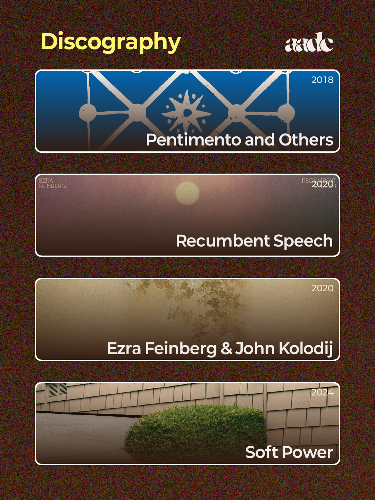

author: "tooearly"
title: "엠비언트 아메리카나 아티스트 디깅 2 - Ezra Feinberg "
order: 10
==========

  

## About Ezra Feinberg

Ezra Feinberg는 뉴욕 북부를 기반으로 하는  
작곡가, 기타리스트 겸 정신분석가입니다.

2000년대 초반 샌프란시스코 앙상블 Citay를 결성해  
음악을 시작한 그는 2018년 엠비언트 아메리카나를  
기반으로 하는 새로운 음악들을 하고있습니다.  

## Discography

* Pentimento and Others
* Recumbent Speech
* Ezra Feinberg & John Kolodij
* Soft Powers