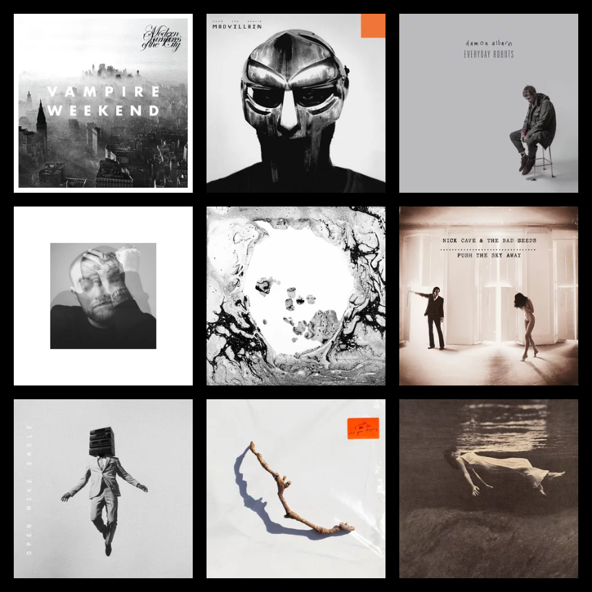

author: "무강"
title: "섬세한 색채와 선율의 그레이"
order: 5
==========

회색과 음악. 음악 이야기를 하려고 하는데 색채 이야기를 꺼내는 건 안 와닿을 수 있겠다. 음악은 기본적으로 청각적 예술이라는 것을 모르는 사람은 없다.

누군가 청각 자체가 고막의 떨림을 통해 전해지는 예술이라고 주장을 한다면, 촉각까지는 그 감각을 연장시킬 수도 있으리라. 음악을 진정 좋아하는 사람 중에 음악을 듣다 '전율'을 느껴보지 않은 사람은 드물 것이므로. 가사에서 문학성을 느끼는 사람도 있겠지만 그건 어디까지나 가사를 들을 때의 이야기고, 뇌과학자들은 뇌파 이야기를 하지만 나는 거기에 대해서는 잘 알지 못한다.

하지만 회색과 음악이다. 음악에서 색채라니. 공감각적 심상이라도 이야기할 셈인가. "푸른 종소리" "금빛 게으른 울음" 뭐 이런 교과서 시에서 나올 법한 표현들. 이 범주가 맞을지는 모르겠지만 글쎄, 그렇게까지 큰 연관을 가지고 생각한 건 아니다.

내가 말하려는 건 조금 더 단순한 개념이다. 나는 음악을 들을 때 음반 단위로 듣는다. 30분 정도면 짧은 편이고, 50분이 넘어가면 너무 길며 40분에서 45분 내외가 딱 적당하다. 주로 영미권의 음악을 듣는 편이지만 (가끔 철이 돌아올 때마다 한국과 일본의 음악을 듣긴 한다) 장르는 크게 가리진 않는다. 락과 힙합 팬덤이 서로에게 눈알을 부라리던 시절이 있었지만 그건 나와는 너무나도 상관없는 이야기다.

음반 선택의 지표로서 내 눈길을 끄는 건 몇 안된다. 그 중 가장 중요하게 작용하는 것은 음반의 커버, 혹은 재킷이라고 불리는 사각형의 사진 혹은 일러스트다. 나는 그 정사각형이 주는 느낌에 집요하게 집착한다.

어떻게 보면 정말로 앨범 커버는 필요없는 요소다. 총기가 가득하던 시절의 칸예 웨스트는 Yeezus를 발매할 때 아예 '앨범 커버'라는 개념을 빼고 음반을 발매한 적이 있다. '음악만으로 평가받겠다는 심리'를 이해못하는 건 아니다. 이젠 정말로 '음반', 정확히는 'LP'나 'CD' 혹은 '카세트 테이프'라는 '물성'에 기댈 필요가 없는 시대가 왔으니까.

이제 우리는 스트리밍을 통해 음악을 듣는 수준이 아니라, 유튜브를 통해 인디 아티스트의 신곡을 듣는다. Vylet Pony나 Louis Zhong 혹은 Nobonoko 등은 자신의 채널에 싱글을 공개한다. 생각해보면 이 분야에서는 Microblank가 먼저였던 것 같기도 하다.

물성에 기대는 시대는 끝난 것처럼 보이고, '앨범 커버'라는 것도 이제 그 개념을 다시 생각해봐야 하는 것 아닌가. 물론 각 아티스트들이 음원을 공개할 때 '썸네일'을 필요로 하는 것도 있으니 '앨범 커버'라는 게 사라질 일은 없을 것이다. 어쩌면 애플 뮤직이 '움직이는 앨범 커버' 시스템을 도입한 것도, 그런 '디지털함'을 반영한 결과일지도 모르겠다.

하지만 나는 여전히 음반을 기억할 때 선율 다음으로 그 표지를 먼저 떠올린다. 그것의 '정확한 제목'이 무엇이었는지, 누구의 '정규 몇 집'이었는지는 그 다음에 떠오른다. 내 머릿속에서 음반의 '선율'과 '커버'는 하나로 이어져 있다.

이를테면 자기 사진을 떡하니 음반에 싣는 부류들이 있다. 가끔은 음악에 비해 사진 나온 게 촌스러워서 다른 커버로 바꿨으면 싶을 때도 있다. 잭 화이트나 노엘 갤러거의 솔로 음반이라거나, 주로 블루스 아티스트들이 그렇다. 몇몇 힙합 아티스트들도 그러는 편이다.

나는 그들을 이해한다. 그들에게 '음악'은 '자신의 음악'이므로. 음악을 해오며 형성한 에고가 스스로를 만들고, 그 스스로를 커버에 드러내는 것 뿐이므로. 그리고 커버가 실린 음반은 다시 자기 자신의 서사로 돌아온다. 완벽한 자신으로의 귀결이 아닌가?

사이키델릭 아티스트들은 조금 이해할 수 없는 초현실적인 총천연색의 색채를 싣는 편이다. 스토너나 둠 메탈을 보여주는 아티스트들은 거칠고 악마적인 색채를 커버에 담아낸다.

그리고, 돌고 돌아서 다시 회색이다. 내가 본격적으로 음반을 듣기 시작한 건 라디오헤드가 9집 A Moon Shaped Pool을 내고 길고 긴 침묵으로 돌아서기 전의 일이다. '달 모양의 연못'이라는 제목과, 심연으로 빠져드는 듯한 회색 소용돌이의 표지. 그때 라디오헤드가 보여줬던 음색은 직전 음반 King of the Limbs의 조용한 전자음에 영화적인 현악이 더해진 섬세한 선율이었다.

가만히 듣고 있으면 비워지는 느낌이 들었다. 어떤 저항감도 없이 심연 밑바닥으로 가라앉는 느낌. 폴 토마스 앤더슨이 감독한 Daydreaming의 뮤직비디오처럼, 어디론가 자꾸만 문을 열고 깊숙한 곳으로 내려가고 있다는 느낌을 받았다. 이 음반의 마지막 트랙인 True Love Waits는 미발표곡 상태로도 굉장히 자주 들었던 음악인데, 그 곡에 다다라서 나는 내가 찾던 무언가가 사랑이었음을 깨닫는다.

그리고 그 상태로 라디오헤드는 멈춰버렸다. 이따금 톰 요크나 에드 그린우드 등이 개인 활동을 하고, The Smile을 결성해 정규 음반을 3개나 발매했지만 그들은 중요한 때 중요한 과제에 침묵하고 있다는 생각이 든다. 그리고 뭣보다, 새로운 노래들은 A Moon Shaped Pool과는 달랐다. 그것들은 '회색'이 아니었으므로.

회색만을 엄청나게 찾아다닌 건 아니었다. 음악의 색채란 코에 걸면 코걸이, 귀에 걸면 귀걸이인 부분도 많은데다, 음악의 색채가 꼭 회색이어야 할 필요는 없지 않은가.

이를테면 화이트 스트라입스는 강렬한 빨강, 거기서 독립해 솔로 아티스트가 된 잭 화이트는 강렬한 파랑을 보여주는 편이다. 초기의 프란츠 퍼디난드는 강렬한 러시아 미술을 활용하고, 이에 반해 스트록스는 6번째 정규 음반 A New Abnormal에서 바스키야를 인용했다.

하지만 나는 어느 지점에서 항상 회색으로 돌아온다. 남의 빨간색이든 파란색이든 총천연색이든, 항상 그것은 내 퍼스널 컬러가 아니었다. 다양한 색채의 음반을 즐기다가도, 언제나 그것은 '내 음악은 아니다'라는 괴리감을 느끼는 것이다.

여타 다른 색이 그렇듯 회색은 다양한 음색을 담아낸다. 아마도 채도가 비어있는, 채도를 채워넣을 수 있는 색이기 때문일 것이다. Vampire Weekend는 Modern Vampires of the City에서 따뜻한 위로의 선율을 건넨다. 맥 밀러의 유고 음반인 Circles이나 데이먼 알반의 첫 솔로 음반은 Everyday Robots 유쾌하고 무기력한 스스로의 모습을 가감없이 드러내기 위해 회색의 색채를 사용한다.

회색은 힙합에서도 자주 쓰이는 음색이다. MF DOOM(무조건 대문자로 쓸 것)은 Madlib과 Madvillainy를 만들 때 회색을 사용했으며 Open Mike Eagle의 신보인 Neigborhood Gods Unlimited에서 회색을 사용했다. KA는 죽기 직전까지 회색의 단골 손님이었으며 켄드릭 라마까지도 회색을 벌써 두 번이나 사용했다.

그런가 하면 어떤 고딕하고 어두운 감정을 끌어내기 위해 사용하는 회색이 있다. PJ 하비, 닉 케이브 앤 배드 시드가 회색을 사용했으며 빌 에반스와 짐 홀도 Undercurrent에서 회색을 사용하지 않았던가.

회색 음반으로 돌아온다는 것은 무엇일까. 회색(Greyscale)은 흑백(Monochrome/Black & White)과도 다르다. 흑백은 차라리 선명함을 드러낸다. 대담함이고, 자신감이다. 검은색이 강렬한 만큼이나 하얀색 또한 그렇다. 레이지 어게인스트 더 머신은 스스로의 강렬함을 강하게 드러내기 위해 틱광둑의 흑백 사진을 활용했다.

회색은 흑백과는 꽤 닮았지만 다르다. 희뿌연 연기 속에서, 우리는 흐려진다. 흑백 논리를 거부하고 회색이 된 채, 이도저도 결정하지 못한 채 우리는 회색이 된다. 회색의 선율은 그런 흐린 우리 자체를 조명한다. 회색은 차라리 연약한 색채인 셈이다.

하지만 우리가 예술에, 선율에 바라는 것은 선명함 만큼이나 연약함과 모호함 아닌가. 회색의 선율이 가진, 자기고백에 가까운 우유부단함과 솔직함은 앨범의 표지를 경유해 우리에게 말한다. 괜찮다고.
