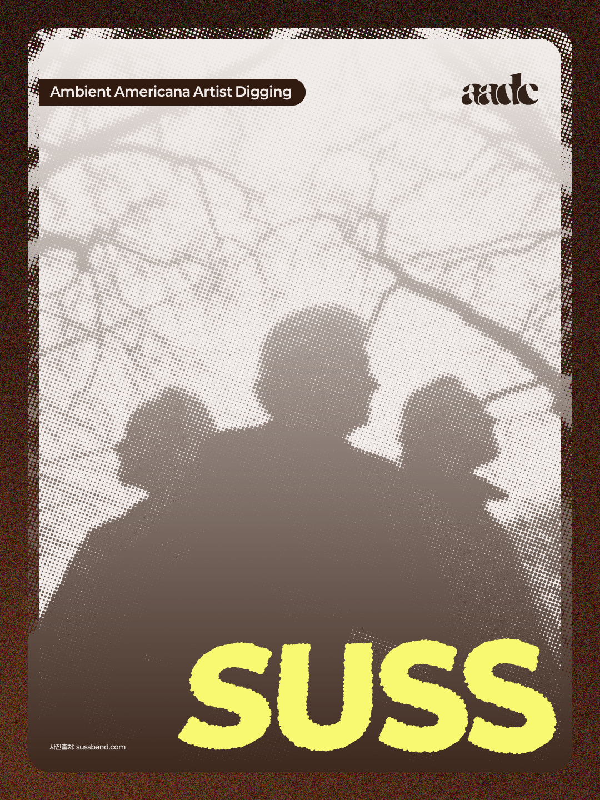
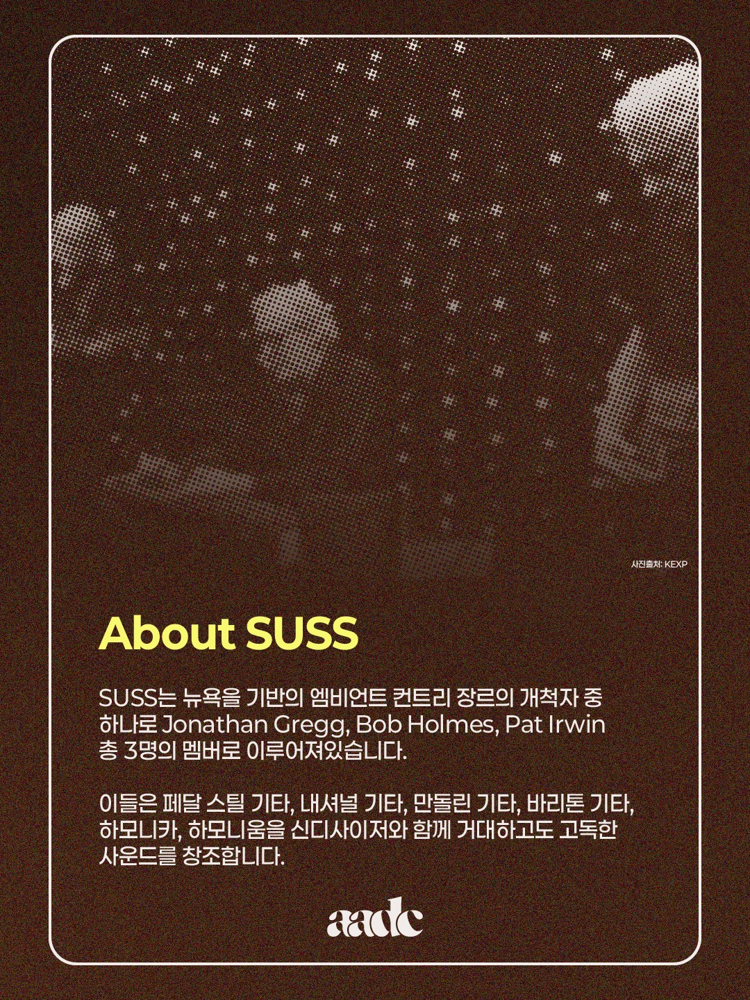
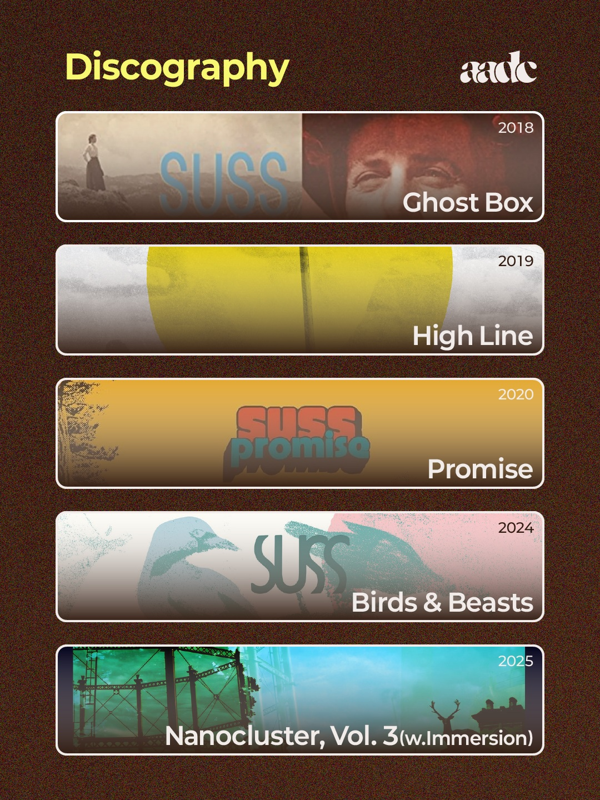

author: "tooearly"
title: "엠비언트 아메리카나 아티스트 디깅 1 - SUSS"
order: 8
==========

  

## About SUSS

SUSS는 뉴욕을 기반의 엠비언트 컨트리 장르의 개척자 중 하나로 Jonathan Gregg, Bob Holmes, Pat Irwin 총 3명의 멤버로 이루어져있습니다.

이들은 페달 스틸 기타, 내셔널 기타, 만돌린 기타, 바리톤 기타, 하모니카, 하모니움을 신디사이저와 함께 거대하고도 고독한사운드를 창조합니다.

## Discography

* Ghost Box
* High Line
* Promise
* Birds & Beasts
* Nanocluster, Vol.3